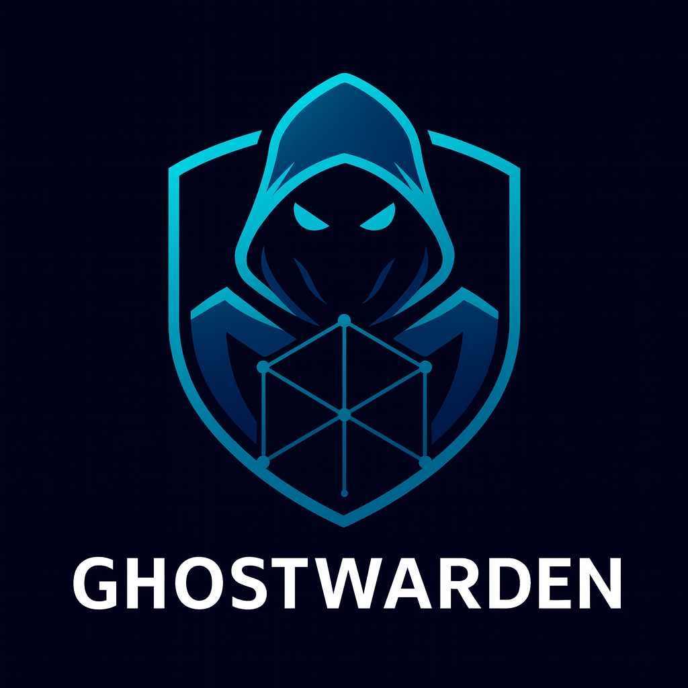

# Ghostwarden

<div align="center">
  

  **Linux network guardian for nftables, bridges, VM networks, and lab policy enforcement.**

  [](https://www.rust-lang.org)
  [](docs/reference/nftables.md)
  [](docs/reference/topology-format.md)
  [](docs/reference/commands.md)
  [](docs/operations/observability.md)
  <br>
  [](docs/integrations/proxmox.md)
  [](docs/integrations/libvirt.md)
  [](docs/security/policy-hardening.md)
  [](docs/getting-started/installation.md)
  [](LICENSE)

  *ufw++ for Linux bridges, nftables, container networks, and VM labs.*
</div>

---

> **Status - experimental.** Ghostwarden can plan and apply real host networking changes. Treat it as lab-first software until your topology, rollback path, and out-of-band access are tested.

---

## Overview

Ghostwarden is a Rust workspace for declarative Linux network orchestration. It turns topology and policy files into bridge, VLAN, VXLAN, NAT, port-forward, DHCP/DNS, and nftables state with a CLI-first workflow.

The project is aimed at Arch Linux workstations, Proxmox nodes, libvirt labs, and security-focused home or small infrastructure networks where the default firewall tools do not give enough visibility into VM and bridge traffic.

## Status

| Area | State | Notes |
|------|-------|-------|
| Topology TOML/YAML | Implemented | TOML default, YAML still loads; routed, bridge, and VXLAN models exist |
| Planning | Implemented | dry-run plan generation from topology files |
| nftables | Implemented | ruleset generation, NAT, forwarding, diff helpers |
| Bridges/VLANs | Implemented | rtnetlink-backed create, status, attach, detach |
| dnsmasq | Partial | config and lease helpers exist; service lifecycle needs hardening |
| Policy profiles | Implemented | routed-tight, public-web, and l2-lan examples |
| Libvirt | Partial | virsh-backed VM listing and bridge attachment |
| TUI | Implemented | ratatui status dashboard |
| Metrics | Implemented | Prometheus endpoint scaffold |
| Production safety | In progress | rollback exists, but atomic apply and state persistence need work |

See [tasks/todo.md](tasks/todo.md) for the current implementation backlog.

## Features

### Declarative Network Topologies

- Model routed networks, L2 bridges, VLANs, and VXLAN overlays in TOML (YAML still supported).
- Generate a plan before touching host networking state.
- Keep the topology file at `/etc/gwarden/ghostnet.toml` for repeatable host setup.

### nftables Policy Engine

- Build nftables JSON rulesets for NAT, forwarding, and per-network policy.
- Manage MASQUERADE, DNAT, and stateful forwarding rules.
- Compare desired rules against live host state with `gwarden net diff`.

### VM and Lab Networking

- Attach libvirt VMs to Ghostwarden-managed bridges.
- Detect bridge and nftables status from the host.
- Fit Proxmox-style `vmbr*` networking while keeping Ghostwarden as the policy layer.

### Troubleshooting and Visibility

- Run `gwarden doctor` for nftables, Docker, and bridge diagnostics.
- Launch a TUI with bridge, nftables, and DHCP lease views.
- Expose Prometheus metrics for scrape-based monitoring.

## Quick Start

```bash
git clone https://github.com/ghostkellz/ghostwarden.git
cd ghostwarden

cargo build --release
sudo install -Dm755 target/release/gwarden /usr/local/bin/gwarden

sudo gwarden net plan -f examples/ghostnet.toml
sudo gwarden doctor
```

Apply only after reviewing the plan and confirming you have a recovery path:

```bash
sudo gwarden net apply -f examples/ghostnet.toml --commit --confirm 60
```

## Example Topology

```toml
version = 1

[interfaces]
uplink = "enp6s0"

[networks.nat_dev]
type = "routed"
cidr = "10.33.0.0/24"
gw_ip = "10.33.0.1"
dhcp = true
masq_out = "enp6s0"
policy_profile = "routed-tight"

[networks.nat_dev.dns]
enabled = true
zones = ["dev.lan"]

[[networks.nat_dev.forwards]]
public = "0.0.0.0:4022/tcp"
dst = "10.33.0.10:22"
```

YAML topologies (`.yaml`/`.yml`) still load for backward compatibility.

## Common Commands

```bash
gwarden net plan -f examples/ghostnet.toml
gwarden net apply -f examples/ghostnet.toml --commit --confirm 60
gwarden net status
gwarden net diff -f examples/ghostnet.toml
gwarden net rollback --execute
gwarden net state

gwarden doctor
gwarden doctor nftables
gwarden doctor docker
gwarden doctor bridges

gwarden vm list
gwarden vm attach --vm devbox --net nat_dev

gwarden metrics serve --addr :9138
gwarden tui
```

## Documentation

The full documentation hub lives at [docs/README.md](docs/README.md).

| Section | Key pages |
|---------|-----------|
| [Getting Started](docs/getting-started/) | [Installation](docs/getting-started/installation.md) - [Configuration](docs/getting-started/configuration.md) - [Quick Start](docs/getting-started/quick-start.md) |
| [Architecture](docs/architecture/) | [Overview](docs/architecture/overview.md) - [Planner](docs/architecture/planner.md) - [Rollback](docs/architecture/rollback.md) |
| [Reference](docs/reference/) | [Commands](docs/reference/commands.md) - [Topology Format](docs/reference/topology-format.md) - [Policy Profiles](docs/reference/policy-profiles.md) |
| [Operations](docs/operations/) | [Production Readiness](docs/operations/production-readiness.md) - [Observability](docs/operations/observability.md) |
| [Integrations](docs/integrations/) | [Proxmox](docs/integrations/proxmox.md) - [Libvirt](docs/integrations/libvirt.md) |
| [Troubleshooting](docs/troubleshooting/) | [Doctor](docs/troubleshooting/doctor.md) - [Common Issues](docs/troubleshooting/common-issues.md) |

## Project Layout

```text
ghostwarden/
├── crates/
│   ├── gw-cli/             # gwarden CLI
│   ├── gw-core/            # topology, planning, policies, rollback
│   ├── gw-nft/             # nftables rules and status
│   ├── gw-nl/              # rtnetlink bridge/address/VLAN helpers
│   ├── gw-dhcpdns/         # dnsmasq config and lease handling
│   ├── gw-libvirt/         # virsh/libvirt bridge attachment helpers
│   ├── gw-metrics/         # Prometheus metrics endpoint
│   ├── gw-troubleshoot/    # doctor diagnostics
│   └── gw-tui/             # ratatui dashboard
├── docs/                   # documentation hub
├── examples/               # topology and policy examples
├── release/                # systemd units, install assets, man pages
└── tasks/                  # roadmap and implementation backlog
```

## Build and Test

```bash
cargo fmt --all
cargo check --workspace
cargo test --workspace
cargo audit
```

`cargo audit` requires the `cargo-audit` subcommand.

## License

MIT. See [LICENSE](LICENSE).
