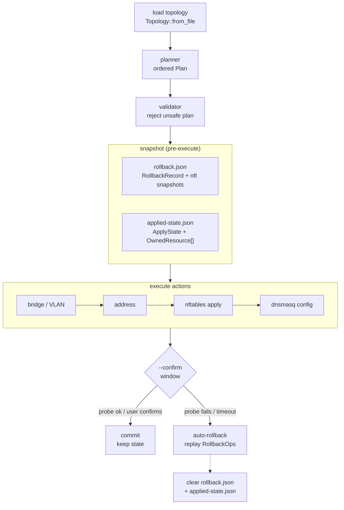
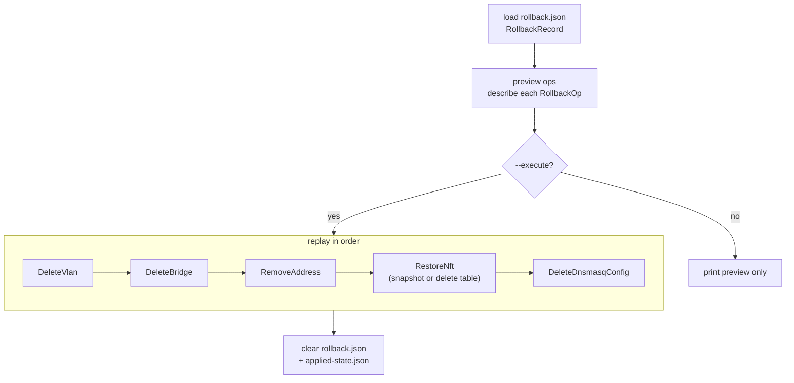
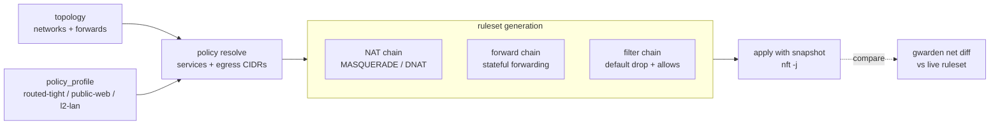
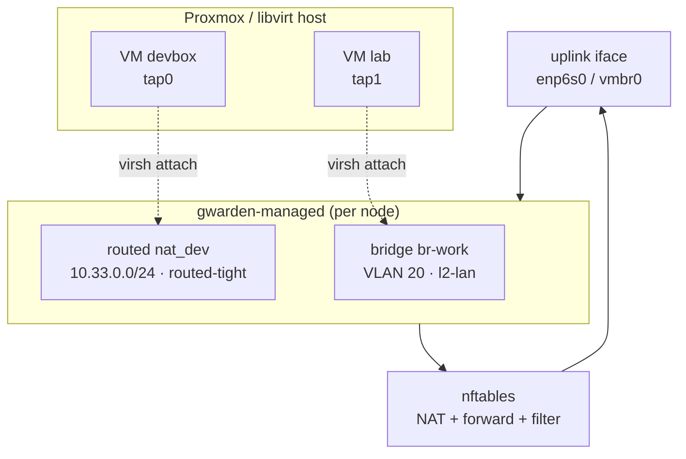

# Diagrams

Visual references for the apply, rollback, nftables, and VM-topology flows. See
[Overview](overview.md) for the high-level crate pipeline.

## Apply Flow

`gwarden net apply` plans, snapshots, executes, then holds a confirmation window
before committing. If the confirm window expires or a probe fails, it auto-rolls back.

## Rollback Flow

`gwarden net rollback` (no `--execute`) previews the operations; with `--execute`
it replays each `RollbackOp` in order, then clears the record.

## nftables Pipeline

Topology plus the referenced policy profile resolve into a generated ruleset that is
applied with a snapshot and can be diffed against the live host.

## Proxmox / libvirt VM Topology

Ghostwarden owns the bridges and VLANs on each node; VMs attach their tap interfaces
to those bridges via `virsh`, while the uplink carries routed/NAT traffic out.

