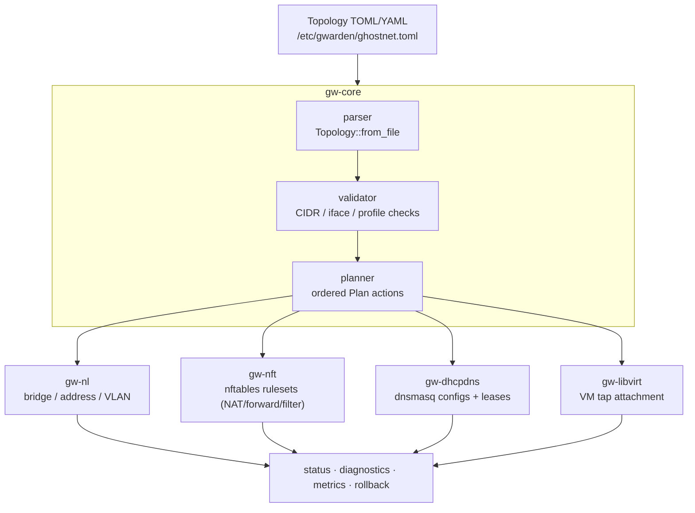

# Architecture Overview

Ghostwarden is designed around a simple pipeline:

## Design Goals

- CLI-first operations that are easy to audit over SSH.
- Declarative topology files that can be versioned and reviewed.
- nftables-native firewall and NAT behavior.
- Rollback-aware host changes.
- Practical coexistence with Proxmox, libvirt, Docker, and NetworkManager.

## Current Boundaries

Ghostwarden does not try to replace every host network manager. It should own the networks declared in its topology files and avoid fighting tools that own unrelated interfaces.

The project currently favors explicit system commands and host-native tools over a daemon-only architecture. A daemon mode can build on the same crates after state persistence and apply transactions are hardened.
